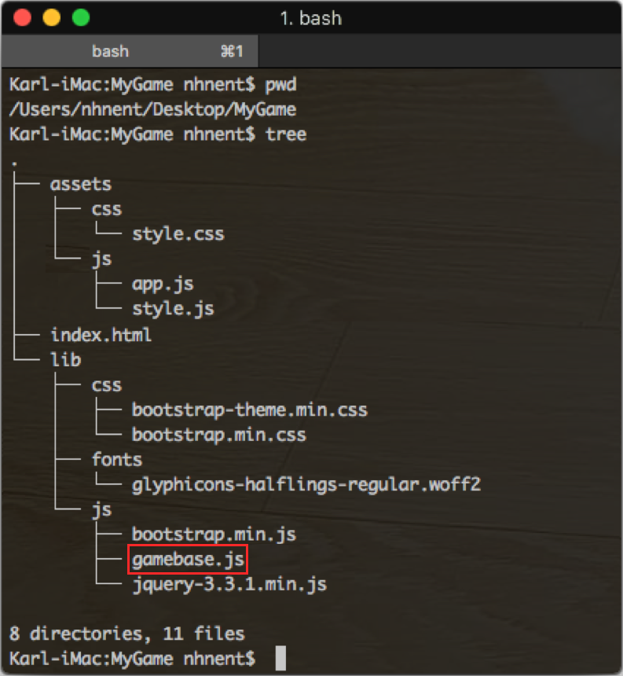

#####
Setup
#####

Download the SDK
================

TOAST에서 JavaScript SDK를 다운로드 받습니다.

Game > Gamebase > JavaScript SDK

* 다운로드: https://docs.toast.com/ko/Download/

Unzip the SDK
=============
다운로드 받은 SDK 파일의 압축을 해제합니다. 압축을 해제하면 다음과 같은 두 개의 파일을 확인 할 수 있습니다.

.. todo::
    localizedstring.json은 배포할 필요가 없을 것 같은데, 고민을 해봐야합니다 !!

:gamebase.min.js: Gamebase JavaScript SDK 파일입니다.

:localizedstring.json: Gamebase 내부에서 사용하는 지역화된 언어 텍스트 파일 셋입니다. 해당 파일의 JSON을 참고 및 수정 후,
                       toast.Gamebase.setDisplayLanguageTable(json) API를 호출하여 내부 텍스트를 변경할 수 있습니다.

Move the SDK to the project
===========================
위에서 압축을 해제한 파일을 아래와 같이, 본인 프로젝트의 적절한 장소로 이동합니다.

import the SDK
==============
Gamebase JavaScript SDK를 연동할 HTML 파일에 다음과 같이 입력합니다.

아래 예시에서는 **gamebase.min.js** 파일이 **/lib/js** 폴더 밑에 있다고 가정하여 작성되었습니다.

.. code-block:: html
   :linenos:

   <!DOCTYPE html>
   <html>
   <head>
       
   </head>
   <body>
       ...
   </body>
   </html>
