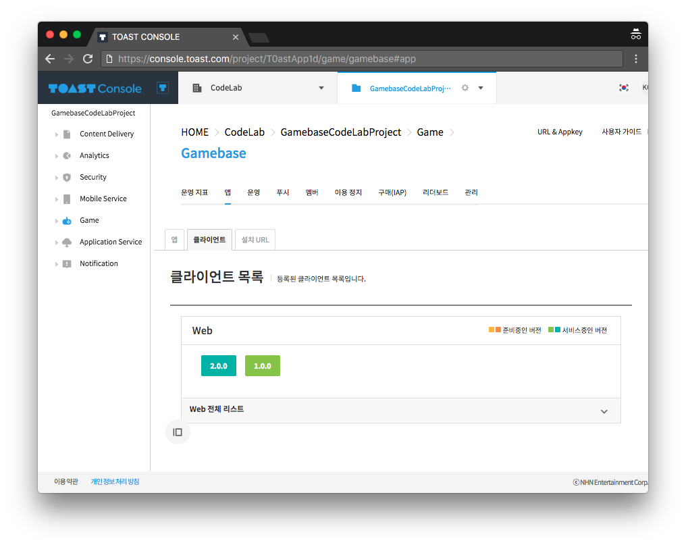

##############
Initialization
##############

Check AppId and ClientVersion
=============================
Gamebase 초기화를 위해서는 필수적으로 **AppId** 와 **ClientVersion** 이 필요합니다.

해당 정보는 TOAST Console의 Gamebase 상품탭에서 확인 할 수 있습니다.

AppId
-----
AppId는 ``Gamebse > App > ID`` 에서 다음과 같이 확인하실 수 있습니다.

아래 스크린샷에서의 AppId는 "*T0astApp1d*" 입니다.

ClientVersion
-------------
ClientVersion은 ``Gamebse > Client > WEB`` 에서 다음과 같이 확인하실 수 있습니다.

초기 프로젝트 생성 후에는 클라이언트들이 등록되어있지 않으므로, 스토어 및 서비스 상태를 고려하여 클라이언트를 등록해주어야합니다.

아래 스크린샷에서는 ClietVersion이 "*1.0.0*" 및 "*2.0.0*" 으로 등록된 것을 확인 할 수 있습니다.

Initialization API
==================

두 필수값(AppId, ClientVersion)을 확인했다면, 해당 값을 이용해 Gamebase 초기화를 진행합니다.

Gamebase 인스턴스는 **window.toast** 하위로 생성이 됩니다. 그러므로 다음 API를 호출하여 초기화를 진행 할 수 있습니다.

.. code-block:: javascript
    :linenos:

    // 초기화 API
    toast.Gamebase.initialize(config, (launchingInfo, error) => { ... })

Configuration
-------------
위의 *toast.Gamebase.initialize* API에 넘기는 첫번째 파라미터는 게임베이스 초기화에 필요한 설정값입니다.

다음과 같은 형식으로 구성되어있으며, 필수 파라미터(appId, appVersion)를 꼭 입력해야 정상 초기화를 진행 할 수 있습니다.

.. code-block:: json
    :linenos:

    {
        appId: appId,  // string - TOAST ProjectID
        clientVersion: clientVersion,  // string - TOAST Gamebase WEB Client Version
        displayLanguageCode: displayLanguageCode, // string - kr|en|ja|vn|zh-Hans|zh-TW|... ISO 639 Language Code
        enableDebugMode: enableDebugMode,  // boolean - 디버그 모드 사용 유무
        uiConfiguration: {
            enablePopup: enablePopup,  // boolean - Gamebase UI 사용 유무
            enableLaunchingStatusPopup: enableLaunchingStatusPopup, // boolean - LaunchingStatus(점검, 서비스종료 등)값에 따라 나타나는 Gamebase UI 사용 유무
            enableBanPopup: enableBanPopup,  // boolean - 이용정지 사용자에 대한 Gamebase UI 사용 유무
        },
    }

LaunchingInfo
-------------
위의 *toast.Gamebase.initialize* API의 콜백으로 오는 값 중, 첫번째 파라미터는 게임베이스의 상태를 알려주는 런칭정보입니다.

해당 값을 통해서, 현재 애플리케이션이 이용가능한 상태인지 아닌지를 알 수 있을 뿐만 아니라, 연동되어있는 타 서비스들에 대한 정보값도 받을 수 있습니다.

뿐만 아니라, 이용가능 상태 등에 따라서, Gamebase UI에 필요한 데이터가 전달되기도 합니다.

해당 LaunchingInfo의 구조는 다음과 같습니다.

.. code-block:: json
    :linenos:

    {
        launching: {
            status: {
                code: code, // number - LaunchingStatusCode
                message: message // string - LaunchingStatus Message
            },
            app: {
                accessInfo: {
                    serverAddress: serverAddress, // string - Console에 입력한 Server Address
                    csInfo: csInfo, // string - Console에 입력한 CS Email 정보입니다.
                }
                relatedUrls: {
                    termsUrl: termsUrl, // string - Console에 입력한 이용약관 URL
                    csUrl: csUrl, // string - Console에 입력한 CS URL
                    punishRuleUrl: punishRuleUrl, // string - Console에 입력한 이용정지 규칙 URL
                    personalInfoCollectionUrl: personalInfoCollectionUrl, // string - Console에 입력한 개인정보 수집 동의 URL
                },
                idP: [ ... ], // Array - Console에 입력한 각 Provider에 대한 정보 (clientId, clientSecret, additionalInfo 등)
                install: {
                    url: url // string - Console에 입력한 설치 URL
                }
            },
            maintenanceInfo: {
                typeCode: typeCode, // string
                pageTypeCode: pageTypeCode, // string
                reason: reason, // string
                message: message, // string
                ...
            },
            noticeInfo: {
                title: title, // string - Console에 입력한 공지사항 타이틀
                message: message, // string - Console에 입력한 공지사항 메세지
                url: url // string - Console에 입력한 공지사항 외부 URL
            },
            ...
        }
    }

LaunchingStatusCode
-------------------
LaunchingStatusCode 값은 아래 URL을 참조합니다.

http://docs.toast.com/ko/Game/Gamebase/ko/aos-initialization/#launching-status-code

Example
=======

게임베이스 초기화에 대한 예시 코드는 다음과 같습니다.

.. raw:: html

    

        <button class="gb-tablinks active" onclick="openCity(event, 'JavaScript')">JavaScript</button>
        <button class="gb-tablinks" onclick="openCity(event, 'HTML')">HTML</button>
        <button class="gb-tablinks" onclick="openCity(event, 'CSS')">CSS</button>
    

    

.. code-block:: html
    :linenos:

    <!DOCTYPE html>
    <html>
    <head>
      
    </head>
    <body>
      <button id="gbInitBtn">Gamebase 초기화</button>
      <textarea id="gbAPIResultTextarea" placeholder="Gamebase API 결과창"></textarea>
    </body>
    </html>

.. raw:: html

    

    

.. code-block:: javascript
    :linenos:

    var gbInitBtn = document.getElementById('gbInitBtn');
    gbInitBtn.addEventListener('click', function() {
        gamebaseInitialize();
    });
    
    var gbAPIResult = '';
    var gbAPIResultTextarea = document.getElementById('gbAPIResultTextarea');
    function addTextToTextArea(text) {
        gbAPIResult += text + '\n';
        gbAPIResultTextarea.value = gbAPIResult;
    }

    function gamebaseInitialize() {
        var appId = 'T0astApp1d';
        var clientVersion = '1.0.0';

        var gamebaseConfiguration = {
            appId: appId,                 // TOAST Console Project ID
            clientVersion: clientVersion, // TOAST Console Gamebase App Client Version
        };  

        // 게임베이스 초기화
        toast.Gamebase.initialize(gamebaseConfiguration, function (launchingInfo, error) {
            if (error) {
                // 초기화에 실패하면 Gamebase SDK를 이용할 수 없습니다.
                // appId, clientVersion 및 TOAST Console의 설정이 정상적으로 입력되었는지 확인하세요.
                console.log('Gamebase initialization failed');
                console.log(error);
    
                addTextToTextArea('Gamebase initialization failed');
                addTextToTextArea(error);
                return;
            }

            var statusCode = launchingInfo.launching.status.code;
            var isPlayable = toast.GamebaseLaunching.isPlayable;
            if (isPlayable(statusCode)) { // Status 값은 하단의 Launching Status Code 표를 참조하시길 바랍니다.
                // 게임 플레이 가능상태입니다.
                console.log('Playable!');
                addTextToTextArea('Playable!');
            } else {
                // 게임 플레이 불가능상태입니다. (점검, 서비스 종료 등)
                console.log('Not Playable!');
                addTextToTextArea('Not Playable!');
            }
            addTextToTextArea(launchingInfo);
        });
    }

.. raw:: html

    

    

.. code-block:: html
    :linenos:

    #gbInitBtn {
      width:200px;
      height:55px;
      border: 1px solid blue;
      background-color: blue;
      color: white;
      font-weight: bold;
      font-size:18px;
      border-radius: 10px;
      cursor: pointer;
    }

    #gbInitBtn:hover {
      opacity: .9;
    }

    #gbAPIResultTextarea {
      position:relative;
      width: 100%;
      height: 400px;
      font-size:14px;
    }

.. raw:: html

    
